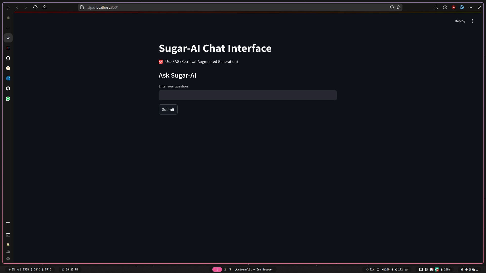

# Sugar-AI Project

This document describes how to run Sugar-AI, test recent changes, and troubleshoot common issues.

## Running Sugar-AI with Docker

Sugar-AI provides a Docker-based deployment option for an isolated and reproducible environment.

### Build the Docker image

Open your terminal in the project's root directory and run:

```sh
docker build -t sugar-ai .
```

### Run the Docker container

- **With GPU (using NVIDIA Docker runtime):**

    ```sh
    docker run --gpus all -it --rm sugar-ai
    ```

- **CPU-only:**

    ```sh
    docker run -it --rm sugar-ai
    ```

The container starts by executing `main.py`. To change the startup behavior, update the Dockerfile accordingly.

## Testing the FastAPI App

The FastAPI server provides endpoints to interact with Sugar-AI.

### Install dependencies

```sh
pip install -r requirements.txt
```

### Run the server

```sh
uvicorn main:app --host 0.0.0.0 --port 8000
```

### Test API endpoints

- **GET endpoint**

    Access the root URL:  
    [http://localhost:8000/](http://localhost:8000/) to see the welcome message.

- **POST endpoint for asking questions**

    To submit a coding question, send a POST request to `/ask` with the `question` parameter. For example:

    ```sh
    curl -X POST "http://localhost:8000/ask?question=How%20do%20I%20create%20a%20Pygame%20window?"
    ```

    The API returns a JSON object with the answer.

- **POST endpoint for debugging python programs**

    To submit your code, send a POST request to `/debug` with the `code` parameter and a `context` flag. For example:

    ```sh
    curl -X POST "http://localhost:8000/debug?code=How%20do%20I%20create%20a%20Pygame%20window&context=False?"
    ```

    The API returns a JSON object with the answer.

- **Additional POST endpoint (/ask-llm)**

    An alternative endpoint `/ask-llm` is available in `main.py`, which provides similar functionality with an enhanced processing pipeline for LLM interactions. To use it, send your coding-related question using:

    ```sh
    curl -X POST "http://localhost:8000/ask-llm?question=How%20do%20I%20create%20a%20Pygame%20window?"
    ```

    The response format is JSON containing the answer generated by the language model.

### API Authentication

Sugar-AI implements an API key-based authentication system for secure access to endpoints.

#### Setting Up Authentication

API keys are defined in the `.env` file with the following format:

```
API_KEYS={"sugarai2024": {"name": "Admin Key", "can_change_model": true}, "user_key_1": {"name": "User 1", "can_change_model": false}}
```

Each key has associated user information:
- `name`: A friendly name for the user (appears in API responses and logs)
- `can_change_model`: Boolean that controls permission to change the model

#### Testing Authentication

To use the authenticated endpoints, include the API key in your request headers:

```sh
curl -X POST "http://localhost:8000/ask?question=How%20do%20I%20create%20a%20Pygame%20window?" \
  -H "X-API-Key: sugarai2024"
```

The response will include the user name:

```json
{
  "answer": "To create a Pygame window...",
  "user": "Admin Key"
}
```

#### Changing Models (Admin Only)

Users with `can_change_model: true` permission can change the model:

```sh
curl -X POST "http://localhost:8000/change-model?model=Qwen/Qwen2-1.5B-Instruct&api_key=sugarai2024&password=sugarai2024"
```

#### Why User Names Are Useful

The user name serves several purposes:
1. It provides identification in API responses, helping track which user made which request
2. It adds context to server logs for monitoring API usage
3. It allows for more personalized interaction in multi-user environments
4. It helps administrators identify which API key corresponds to which user

### Advanced Security Features

Sugar-AI includes several additional security features to protect the API and manage resources effectively:

#### Request Quotas

Each API key has a daily request limit defined in the `.env` file:

```
MAX_DAILY_REQUESTS=100
```

The system automatically tracks usage and resets quotas daily. When testing:

1. Check remaining quota by examining API responses:
   ```json
   {
     "answer": "Your answer here...",
     "user": "User 1",
     "quota": {"remaining": 95, "total": 100}
   }
   ```

2. Test quota enforcement by sending more than the allowed number of requests.
   The API will return a 429 status code when the quota is exceeded:
   ```sh
   curl -i -X POST "http://localhost:8000/ask?question=Test" -H "X-API-Key: user_key_1"
   # After exceeding quota:
   # HTTP/1.1 429 Too Many Requests
   # {"detail":"Daily request quota exceeded"}
   ```

#### Security Logging

Sugar-AI implements comprehensive logging for security monitoring:

1. All API requests are logged with user information, IP addresses, and timestamps
2. Failed authentication attempts are recorded with warning level
3. Model change attempts are tracked with detailed information
4. All logs are stored in `sugar_ai.log` for review

To test logging functionality:
```sh
# Make a valid request
curl -X POST "http://localhost:8000/ask?question=Test" -H "X-API-Key: sugarai2024"

# Make an invalid request
curl -X POST "http://localhost:8000/ask?question=Test" -H "X-API-Key: invalid_key"

# Check the logs
tail -f sugar_ai.log
```

#### CORS and Trusted Hosts

The API implements CORS (Cross-Origin Resource Sharing) and trusted host verification:

- In development mode, API access is allowed from all origins
- For production, consider restricting the `allow_origins` parameter in `main.py`

#### Testing with Streamlit App

The Streamlit app should be updated to include API key authentication:

```python
# Updated streamlit.py example
import streamlit as st
import requests

st.title("Sugar-AI Chat Interface")

# Add API key field
api_key = st.sidebar.text_input("API Key", type="password")

use_rag = st.checkbox("Use RAG (Retrieval-Augmented Generation)", value=True)

st.subheader("Ask Sugar-AI")
question = st.text_input("Enter your question:")

if st.button("Submit"):
    if question and api_key:
        if use_rag:
            url = "http://localhost:8000/ask"
        else:
            url = "http://localhost:8000/ask-llm"
        params = {"question": question}
        headers = {"X-API-Key": api_key}
        try:
            response = requests.post(url, params=params, headers=headers)
            if response.status_code == 200:
                result = response.json()
                st.markdown("**Answer:** " + result["answer"])
                st.sidebar.info(f"Remaining quota: {result['quota']['remaining']}/{result['quota']['total']}")
            else:
                st.error(f"Error {response.status_code}: {response.text}")
        except Exception as e:
            st.error(f"Error contacting the API: {e}")
    elif not question:
        st.warning("Please enter a question.")
    elif not api_key:
        st.warning("Please enter an API key.")
```

Run this updated Streamlit app to test the complete authentication flow and quota visibility.

### Running the RAG Agent from the Command Line

To test the new RAG Agent directly from the CLI, execute:

```sh
python rag_agent.py --quantize
```

Remove the `--quantize` flag if you prefer running without 4‑bit quantization.

### Testing the New Features

1. **Verify Model Setup:**
     - Confirm the selected model loads correctly by checking the terminal output for any errors.
     
2. **Document Retrieval:**
     - Place your documents (PDF or text files) in the directory specified in the default parameters or provide your paths using the `--docs` flag.
     - The vector store is rebuilt every time the agent starts. Ensure your documents are well placed to retrieve relevant content.

3. **Question Handling:**
     - After the agent starts, enter a sample coding-related question.
     - The assistant should respond by incorporating context from the loaded documents and answering your query.
     
4. **API and Docker Route:**
     - Optionally, combine these changes by deploying the updated version via Docker and testing the FastAPI endpoints as described above.

## Troubleshooting CUDA Memory Issues

If you encounter CUDA out-of-memory errors, consider running the agent on CPU or adjust CUDA settings:

```sh
export PYTORCH_CUDA_ALLOC_CONF=expandable_segments:True
```

Review the terminal output for further details and error messages.

## Using the Streamlit App

Sugar-AI also provides a Streamlit-based interface for quick interactions and visualizations.

### Running the Streamlit App

1. **Install Streamlit:**

    If you haven't already, install Streamlit:

    ```sh
    pip install streamlit
    ```

2. **Make sure server is running using:**
    ```sh
    uvicorn main:app --host 0.0.0.0 --port 8000
    ```

3. **Start the App:**

    Launch the Streamlit app by adding streamlit.py file.
    ```python
    #./streamlit.py
    import streamlit as st
    import requests

    st.title("Sugar-AI Chat Interface")

    use_rag = st.checkbox("Use RAG (Retrieval-Augmented Generation)", value=True)

    st.subheader("Ask Sugar-AI")
    question = st.text_input("Enter your question:")

    if st.button("Submit"):
        if question:
            if use_rag:
                url = "http://localhost:8000/ask"
            else:
                url = "http://localhost:8000/ask-llm"
            params = {"question": question}
            try:
                response = requests.post(url, params=params)
                if response.status_code == 200:
                    result = response.json()
                    st.markdown("**Answer:** " + result["answer"])
                else:
                    st.error(f"Error {response.status_code}: {response.text}")
            except Exception as e:
                st.error(f"Error contacting the API: {e}")
        else:
            st.warning("Please enter a question.")
    ```

    ```sh
    streamlit run streamlit.py
    ```

4. **Using the App:**

    - The app provides a simple UI to input coding questions and displays the response using Sugar-AI.
    - Use the sidebar options to configure settings if available.
    - The app communicates with the FastAPI backend to process and retrieve answers.



Enjoy exploring Sugar-AI through both API endpoints and the interactive Streamlit interface!
