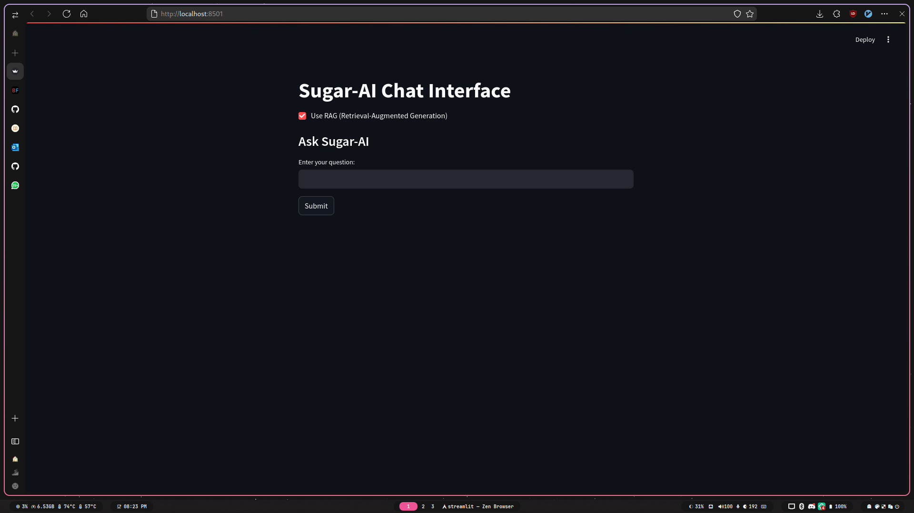

# Sugar-AI Project

This document describes how to run Sugar-AI, test recent changes, and troubleshoot common issues.

## Running Sugar-AI

Sugar-AI now expects an OpenAI-compatible LLM service. The app is decoupled from model serving: `docker compose up` starts only Sugar-AI, while optional Compose profiles can start bundled model backends on the shared `sugar-ai-llm` Docker network.

### Install dependencies

```sh
pip install -r requirements.txt
```

### Configure the initial LLM connection

Set the application seed configuration in `.env`:

```env
LLM_PROVIDER_TYPE=openai_compatible
LLM_BASE_URL=http://ollama:11434/v1
LLM_API_KEY=ollama
LLM_MODEL_NAME=qwen2.5:1.5b
LLM_MAX_MODEL_LENGTH=4096
LLM_DISPLAY_NAME=Default Ollama Qwen
```

This example targets the bundled Ollama service on the Compose network. If you are connecting to your own deployed or hosted OpenAI-compatible service, replace `LLM_BASE_URL`, `LLM_API_KEY`, and `LLM_MODEL_NAME` with values that are reachable from the `sugar-ai` container before the first startup.

On first startup, Sugar-AI seeds one active model record from these values if the database does not already contain an active LLM configuration.
After the `llm_models` table has been initialized, the database becomes the source of truth and later changes to these environment variables do not override the saved model records.

### Docker database persistence

When running through `docker compose`, Sugar-AI now stores SQLite data in a bind-mounted host directory:

- container path: `/app/volume/sugar_ai.db`
- host path: `./volume/sugar_ai.db`

This path is configured through `DATABASE_URL=sqlite:////app/volume/sugar_ai.db` in `docker-compose.yaml`.
If you run the app directly with local Python instead of Docker, the code still falls back to the default relative SQLite path unless you explicitly set `DATABASE_URL` yourself.

If you already have data in an existing container created before this change, it will not move automatically into the new bind-mounted directory. To keep your existing data, copy it out once before recreating the stack:

```sh
mkdir -p volume
docker compose cp sugar-ai:/app/sugar_ai.db ./volume/sugar_ai.db
docker compose up --build
```

After the container is recreated, the app will read and write `./volume/sugar_ai.db` on the host while using `/app/volume/sugar_ai.db` inside the container.

### Legacy model config migration

Older Sugar-AI versions could boot from these environment variables:

- `DEV_MODEL_NAME`
- `PROD_MODEL_NAME`
- `DEFAULT_MODEL`

The current version no longer starts from those keys. On a fresh database, you must configure the OpenAI-compatible seed model with at least:

```env
LLM_BASE_URL=http://ollama:11434/v1
LLM_MODEL_NAME=qwen2.5:1.5b
```

If the app finds only the legacy model keys during first startup, it now stops with a migration error instead of guessing how to map the old configuration to a provider endpoint.

### Start only the app

Start Sugar-AI without any bundled model service:

```sh
docker compose up --build
```

This starts:
- `sugar-ai` on port `8000`
- a reusable Docker network named `sugar-ai-llm`

Before using this mode, make sure `.env` points at an external or self-hosted OpenAI-compatible service that is reachable from the `sugar-ai` container. If your model service is not managed by this Compose file, make sure it can reach or join `sugar-ai-llm`, then create or activate the matching model record from `/admin/models`.

### Run the full stack with Ollama

The example `.env` above already points to the bundled Ollama service:

```env
OLLAMA_PULL_MODEL=qwen2.5:1.5b
```

Then start the app and Ollama together:

```sh
docker compose --profile ollama up --build
```

This starts:
- `sugar-ai` on port `8000`
- `ollama` on port `11434`

The `ollama-pull` helper service downloads `OLLAMA_PULL_MODEL` on first run. Keep `LLM_MODEL_NAME` and `OLLAMA_PULL_MODEL` aligned unless you intentionally manage models yourself inside Ollama.

### Run the full stack with vLLM

If you want the first bootstrap model to point at the bundled vLLM service, update `.env` before the first startup:

```env
LLM_BASE_URL=http://vllm:8000/v1
LLM_API_KEY=not-needed
LLM_MODEL_NAME=Qwen/Qwen2-1.5B-Instruct
LLM_DISPLAY_NAME=Default vLLM Model
```

Then start the app and vLLM together:

```sh
docker compose --profile vllm up --build
```

This starts:
- `sugar-ai` on port `8000`
- `vllm` on port `8001`

The bundled `vllm` service is intentionally minimal and is meant for straightforward local GPU setups. If you have more complex requirements such as CPU serving, multi-GPU tensor parallelism, custom memory limits, quantization, or model-specific launch flags, update the `vllm` service parameters in `docker-compose.yaml` to match your environment.

### Run the app against an external OpenAI-compatible service

If you already have a provider running elsewhere, point `.env` to a URL that is reachable from the `sugar-ai` container and start only the app:

```sh
docker compose up --build
```

Examples:

```env
LLM_BASE_URL=http://host.docker.internal:8001/v1
```

or start your own model container on the same shared network:

```sh
docker run --rm --network sugar-ai-llm ...
```

## Testing the FastAPI App

The FastAPI server provides endpoints to interact with Sugar-AI.

### Test API endpoints

Sugar-AI provides three different endpoints for different use cases:

| Endpoint | Purpose | Input Format | Features |
|----------|---------|--------------|----------|
| `/ask` | RAG-enabled answers | Query parameter | • Retrieval-Augmented Generation<br>• Sugar/Pygame/GTK documentation<br>• Child-friendly responses |
| `/ask-llm` | Direct LLM without RAG | Query parameter | • No document retrieval<br>• Direct model access<br>• Faster responses<br>• Default system prompt and parameters |
| `/ask-llm-prompted(promoted mode[default])` | Custom prompt with advanced controls | JSON body | • Custom system prompts<br>• Configurable model parameters |
| `/ask-llm-prompted(chat=True)` | Accepts chat history with system prompt | JSON body | • Send chat history along with system prompt<br>• Configurable model parameters |

- **GET endpoint**

    Access the root URL:  
    [http://localhost:8000/](http://localhost:8000/) to see the welcome message.

- **POST endpoint for asking questions**

    To submit a coding question, send a POST request to `/ask` with the `question` parameter. For example:

    ```sh
    curl -X POST "http://localhost:8000/ask?question=How%20do%20I%20create%20a%20Pygame%20window?"
    ```

    The API returns a JSON object with the answer.

- **POST endpoint for debugging python programs**

    To submit your code, send a POST request to `/debug` with the `code` parameter and a `context` flag. For example:

    ```sh
    curl -X POST "http://localhost:8000/debug?code=How%20do%20I%20create%20a%20Pygame%20window&context=False?"
    ```

    The API returns a JSON object with the answer.

- **Additional POST endpoint (/ask-llm)**

    An alternative endpoint `/ask-llm` is available in `main.py`, which provides similar functionality with an enhanced processing pipeline for LLM interactions. To use it, send your coding-related question using:

    ```sh
    curl -X POST "http://localhost:8000/ask-llm?question=How%20do%20I%20create%20a%20Pygame%20window?"
    ```

    The response format is JSON containing the answer generated by the language model.

- **Advanced POST endpoint - Custom prompt OR Chat completions + generation parameters (/ask-llm-prompted)**

    A powerful endpoint that allows you to use custom prompts and fine-tune generation parameters. Unlike the other endpoints, this one:
    - Uses your own custom system prompt
    - Accepts JSON request body with configurable model parameters
    - Provides direct LLM access without RAG

    **Basic Usage (Prompted mode):**
    ```sh
    curl -X POST "http://localhost:8000/ask-llm-prompted" \
      -H "X-API-Key: sugarai2024" \
      -H "Content-Type: application/json" \
      -d '{
        "question": "How do I create a Pygame window?",
        "custom_prompt": "You are a Python expert. Provide detailed code examples with explanations."
      }'
    ```

    **Advanced Usage with Generation Parameters (Prompted mode):**
    ```sh
    curl -X POST "http://localhost:8000/ask-llm-prompted" \
      -H "X-API-Key: sugarai2024" \
      -H "Content-Type: application/json" \
      -d '{
        "question": "Write a function to calculate fibonacci numbers",
        "custom_prompt": "You are a coding tutor. Explain step-by-step with comments.",
        "max_length": 1024,
        "truncation": true,
        "temperature": 0.7,
        "top_p": 0.9
      }'
    ```

    **Chat Completions Usage (chat mode):**
    
    If you want to send a conversation history and generate a model response then use 
    this endpoint. The structure of the request and response is kept similar to any 
    popular API providers.
    Use the same endpoint with `chat: true` and provide `messages` instead of `question`/`custom_prompt`.

    ```sh
    curl -X POST "http://localhost:8000/ask-llm-prompted" \
      -H "X-API-Key: sugarai2024" \
      -H "Content-Type: application/json" \
      -d '{
        "chat": true,
        "messages": [
          {"role": "system", "content": "You are a helpful Python assistant."},
          {"role": "user", "content": "Write a Python function to reverse a string."},
          {"role": "assistant", "content": "You can use slicing: s[::-1]."},
          {"role": "user", "content": "Show me a complete example."}
        ],
        "max_length": 512,
        "temperature": 0.6,
        "top_p": 0.9
      }'
    ```
    - Send chat history with roles `system`, `user`, and `assistant`.
    - The response mirrors common chat APIs and includes `choices[0].message.content`.

    **Request Parameters:**
    - `chat` (optional, default: false): When true, use chat completions mode.
    - `question` (required when `chat=false`): The question or task to process
    - `custom_prompt` (required when `chat=false`): Your custom system prompt
    - `messages` (required when `chat=true`): Array of `{role, content}` messages where role is one of `system`, `user`, `assistant`
    - `max_length` (optional, default: 1024): Maximum length of generated response
    - `truncation` (optional, default: true): Whether to truncate long inputs
    - `temperature` (optional, default: 0.7): Controls randomness (0.0 = deterministic, 1.0 = very random)
    - `top_p` (optional, default: 0.9): Nucleus sampling (0.1 = focused, 0.9 = diverse)

    **Response Format (Prompted mode):**
    ```json
    {
      "answer": "Here's how to create a Pygame window:\n\nimport pygame...",
      "user": "Admin Key",
      "quota": {"remaining": 95, "total": 100},
      "generation_params": {
        "max_length": 1024,
        "truncation": true,
        "temperature": 0.7,
        "top_p": 0.9
      }
    }
    ```

    **Response Format (Chat mode):**
    ```json
    {
      "choices": [
        {
          "message": {
            "role": "assistant",
            "content": "Here is a complete example..."
          },
          "index": 0,
          "finish_reason": "stop"
        }
      ],
      "user": "Admin Key",
      "quota": {"remaining": 95, "total": 100},
      "generation_params": {
        "max_length": 512,
        "truncation": true,
        "temperature": 0.6,
        "top_p": 0.9
      }
    }
    ```

    - Actual response of the model can be accessed by:
    ```py
    data = json.loads(response)
    content = data["choices"][0]["message"]["content"]
    print(content)
    ```

    **Use Cases:**
    Prompted Mode: Different activites can now use different system prompts and different generation parameters to achieve a model that is personalized to that activites needs.  
    Chat Mode: They can also use the chat mode to give context of chat history to the LLM better suited for conversational style features.

    **Generation Parameter Guidelines:**
    - **For Code**: `temperature: 0.2-0.4, top_p: 0.8`
    - **For Creative Content**: `temperature: 0.7-0.9, top_p: 0.9`
    - **For Factual Answers**: `temperature: 0.3-0.5, top_p: 0.7`

### API Authentication

Sugar-AI implements an API key-based authentication system for secure access to endpoints.

#### Setting Up Authentication

API keys are defined in the `.env` file with the following format:

```
API_KEYS={"sugarai2024": {"name": "Admin Key", "can_change_model": true}, "user_key_1": {"name": "User 1", "can_change_model": false}}
```

Each key has associated user information:
- `name`: A friendly name for the user (appears in API responses and logs)
- `can_change_model`: Boolean that controls permission to change the model

#### Testing Authentication

To use the authenticated endpoints, include the API key in your request headers:

```sh
curl -X POST "http://localhost:8000/ask?question=How%20do%20I%20create%20a%20Pygame%20window?" \
  -H "X-API-Key: sugarai2024"
```

The response will include the user name:

```json
{
  "answer": "To create a Pygame window...",
  "user": "Admin Key"
}
```

#### Changing Models (Admin Only)

Users with `can_change_model: true` permission can switch the active model record:

```sh
curl -X POST "http://localhost:8000/change-model?model_id=1&api_key=sugarai2024&password=sugarai2024"
```

#### Managing Model Records (Admin Only)

List models:

```sh
curl -X GET "http://localhost:8000/admin/models" \
  -H "X-API-Key: sugarai2024"
```

Create a model record:

```sh
curl -X POST "http://localhost:8000/admin/models" \
  -H "X-API-Key: sugarai2024" \
  -H "Content-Type: application/json" \
  -d '{
    "name": "Backup vLLM",
    "provider_type": "openai_compatible",
    "base_url": "http://localhost:8002/v1",
    "api_key": "not-needed",
    "model_name": "Qwen/Qwen2-1.5B-Instruct",
    "max_model_length": 4096,
    "is_active": false
  }'
```

#### API Smoke Test Script

An executable smoke test script is available at `scripts/test_api.py`.

Run it against a live server:

```sh
APP_BASE_URL=http://localhost:8000 \
TEST_API_KEY=user_key_1 \
ADMIN_API_KEY=sugarai2024 \
MODEL_CHANGE_PASSWORD=sugarai2024 \
python3 scripts/test_api.py
```

For repository-only verification without a live LLM service, use the internal mode:

```sh
python3 scripts/test_api.py --internal
```

#### Why User Names Are Useful

The user name serves several purposes:
1. It provides identification in API responses, helping track which user made which request
2. It adds context to server logs for monitoring API usage
3. It allows for more personalized interaction in multi-user environments
4. It helps administrators identify which API key corresponds to which user

### Advanced Security Features

Sugar-AI includes several additional security features to protect the API and manage resources effectively:

#### Request Quotas

Each API key has a daily request limit defined in the `.env` file:

```
MAX_DAILY_REQUESTS=100
```

The system automatically tracks usage and resets quotas daily. When testing:

1. Check remaining quota by examining API responses:
   ```json
   {
     "answer": "Your answer here...",
     "user": "User 1",
     "quota": {"remaining": 95, "total": 100}
   }
   ```

2. Test quota enforcement by sending more than the allowed number of requests.
   The API will return a 429 status code when the quota is exceeded:
   ```sh
   curl -i -X POST "http://localhost:8000/ask?question=Test" -H "X-API-Key: user_key_1"
   # After exceeding quota:
   # HTTP/1.1 429 Too Many Requests
   # {"detail":"Daily request quota exceeded"}
   ```

#### Security Logging

Sugar-AI implements comprehensive logging for security monitoring:

1. All API requests are logged with user information, IP addresses, and timestamps
2. Failed authentication attempts are recorded with warning level
3. Model change attempts are tracked with detailed information
4. All logs are stored in `sugar_ai.log` for review

To test logging functionality:
```sh
# Make a valid request
curl -X POST "http://localhost:8000/ask?question=Test" -H "X-API-Key: sugarai2024"

# Make an invalid request
curl -X POST "http://localhost:8000/ask?question=Test" -H "X-API-Key: invalid_key"

# Check the logs
tail -f sugar_ai.log
```

#### CORS and Trusted Hosts

The API implements CORS (Cross-Origin Resource Sharing) and trusted host verification:

- In development mode, API access is allowed from all origins
- For production, consider restricting the `allow_origins` parameter in `main.py`

#### Testing with Streamlit App

The Streamlit app should be updated to include API key authentication and support for all three endpoints:

```python
# Updated streamlit.py example
import streamlit as st
import requests
import json

st.title("Sugar-AI Chat Interface")

# Add API key field
api_key = st.sidebar.text_input("API Key", type="password")

# Endpoint selection
endpoint_choice = st.selectbox(
    "Choose endpoint:",
    ["RAG (ask)", "Direct LLM (ask-llm)", "Custom Prompt (ask-llm-prompted)"]
)

st.subheader("Ask Sugar-AI")
question = st.text_input("Enter your question:")

# Custom prompt section for ask-llm-prompted
custom_prompt = ""
generation_params = {}

if endpoint_choice == "Custom Prompt (ask-llm-prompted)":
    custom_prompt = st.text_area(
        "Custom Prompt:", 
        value="You are a helpful assistant. Provide clear and detailed answers.",
        help="This prompt will replace the default system prompt"
    )
    
    # Generation parameters
    with st.expander("Advanced Generation Parameters"):
        col1, col2 = st.columns(2)
        
        with col1:
            max_length = st.number_input("Max Length", value=1024, min_value=100, max_value=2048)
            temperature = st.slider("Temperature", 0.0, 1.0, 0.7, 0.1)
        
        with col2:
            top_p = st.slider("Top P", 0.1, 1.0, 0.9, 0.1)
            truncation = st.checkbox("Truncation", value=True)
    
    generation_params = {
        "max_length": max_length,
        "truncation": truncation,
        "temperature": temperature,
        "top_p": top_p
    }

if st.button("Submit"):
    if question and api_key:
        headers = {"X-API-Key": api_key}
        
        try:
            if endpoint_choice == "RAG (ask)":
                url = "http://localhost:8000/ask"
                params = {"question": question}
                response = requests.post(url, params=params, headers=headers)
                
            elif endpoint_choice == "Direct LLM (ask-llm)":
                url = "http://localhost:8000/ask-llm"
                params = {"question": question}
                response = requests.post(url, params=params, headers=headers)
                
            elif endpoint_choice == "Custom Prompt (ask-llm-prompted)":
                url = "http://localhost:8000/ask-llm-prompted"
                headers["Content-Type"] = "application/json"
                data = {
                    "question": question,
                    "custom_prompt": custom_prompt,
                    **generation_params
                }
                response = requests.post(url, headers=headers, data=json.dumps(data))
            
            if response.status_code == 200:
                result = response.json()
                st.markdown("**Answer:** " + result["answer"])
                st.sidebar.info(f"User: {result.get('user', 'Unknown')}")
                st.sidebar.info(f"Remaining quota: {result['quota']['remaining']}/{result['quota']['total']}")
                
                # Show generation parameters for custom prompt endpoint
                if endpoint_choice == "Custom Prompt (ask-llm-prompted)" and "generation_params" in result:
                    with st.expander("Generation Parameters Used"):
                        st.json(result["generation_params"])
                        
            else:
                st.error(f"Error {response.status_code}: {response.text}")
                
        except Exception as e:
            st.error(f"Error contacting the API: {e}")
            
    elif not question:
        st.warning("Please enter a question.")
    elif not api_key:
        st.warning("Please enter an API key.")
```

Run this updated Streamlit app to test the complete authentication flow and quota visibility.

### Running the RAG Agent from the Command Line

To test the new RAG Agent directly from the CLI, execute:

```sh
python rag_agent.py --quantize
```

Remove the `--quantize` flag if you prefer running without 4‑bit quantization.

### Testing the New Features

1. **Verify Model Setup:**
     - Confirm the selected model loads correctly by checking the terminal output for any errors.
     
2. **Document Retrieval:**
     - Place your documents (PDF or text files) in the directory specified in the default parameters or provide your paths using the `--docs` flag.
     - The vector store is rebuilt every time the agent starts. Ensure your documents are well placed to retrieve relevant content.

3. **Question Handling:**
     - After the agent starts, enter a sample coding-related question.
     - The assistant should respond by incorporating context from the loaded documents and answering your query.
     
4. **API and Docker Route:**
     - Optionally, combine these changes by deploying the updated version via Docker and testing the FastAPI endpoints as described above.

## Troubleshooting CUDA Memory Issues

If you encounter CUDA out-of-memory errors, consider running the agent on CPU or adjust CUDA settings:

```sh
export PYTORCH_CUDA_ALLOC_CONF=expandable_segments:True
```

Review the terminal output for further details and error messages.

## Setting up CI/CD Environment Variables

When deploying Sugar-AI in CI/CD pipelines, you'll need to configure environment variables properly. Current CI/CD uses github webhooks. So make sure to create a webhook secret and add it to the `.env`.

## Using the Streamlit App

Sugar-AI also provides a Streamlit-based interface for quick interactions and visualizations.

### Running the Streamlit App

1. **Install Streamlit:**

    If you haven't already, install Streamlit:

    ```sh
    pip install streamlit
    ```

2. **Make sure server is running using:**
    ```sh
    uvicorn main:app --host 0.0.0.0 --port 8000
    ```

3. **Start the App:**

    Launch the Streamlit app by adding streamlit.py file.
    ```python
    #./streamlit.py
    import streamlit as st
    import requests

    st.title("Sugar-AI Chat Interface")

    use_rag = st.checkbox("Use RAG (Retrieval-Augmented Generation)", value=True)

    st.subheader("Ask Sugar-AI")
    question = st.text_input("Enter your question:")

    if st.button("Submit"):
        if question:
            if use_rag:
                url = "http://localhost:8000/ask"
            else:
                url = "http://localhost:8000/ask-llm"
            params = {"question": question}
            try:
                response = requests.post(url, params=params)
                if response.status_code == 200:
                    result = response.json()
                    st.markdown("**Answer:** " + result["answer"])
                else:
                    st.error(f"Error {response.status_code}: {response.text}")
            except Exception as e:
                st.error(f"Error contacting the API: {e}")
        else:
            st.warning("Please enter a question.")
    ```

    ```sh
    streamlit run streamlit.py
    ```

4. **Using the App:**

    - The app provides a simple UI to input coding questions and displays the response using Sugar-AI.
    - Use the sidebar options to configure settings if available.
    - The app communicates with the FastAPI backend to process and retrieve answers.



Enjoy exploring Sugar-AI through both API endpoints and the interactive Streamlit interface!
