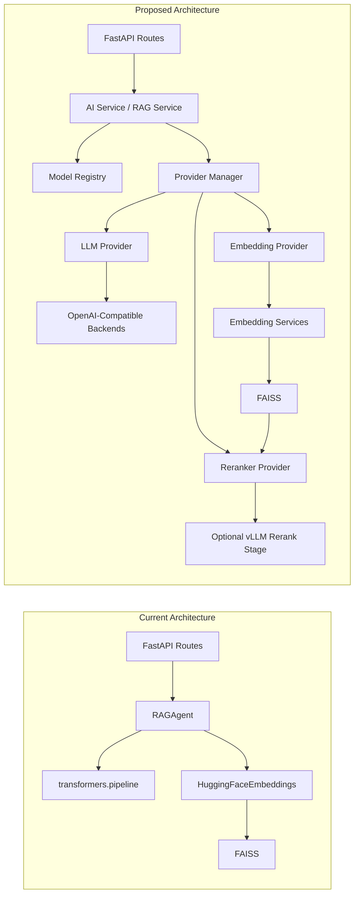

# GSoC 2026 Proposal Draft

## AI Optimization for Sugar-AI

**Applicant:** Yu Jing  
**Organization:** Sugar Labs  
**Project Size:** 150 hours

---

## Overview

Sugar-AI already provides a working FastAPI backend for educational AI features, including RAG, direct LLM access, debugging support, and a lightweight dashboard. However, its current model layer is tightly coupled to a single local Hugging Face runtime.

The goal of this project is to make Sugar-AI easier to deploy with self-hosted or local model services. I propose to refactor the current backend into a small provider-oriented runtime with:

- an LLM abstraction layer,
- local model discovery and registration,
- frontend-facing model selection APIs,
- an embedding abstraction layer,
- and a reranker abstraction for vLLM-style rerank endpoints.

The main design inspiration is OpenCode's explicit provider-oriented runtime: a lightweight model registry, provider interface, and provider factory, instead of a hardcoded single backend.

---

## Current Problem

From the current Sugar-AI codebase:

- [`main.py`](/Users/yujing/Projects/sugar-ai/main.py) initializes a single `RAGAgent` and injects it globally into the API layer.
- [`app/ai.py`](/Users/yujing/Projects/sugar-ai/app/ai.py) directly uses `transformers.pipeline(...)` for generation.
- [`app/ai.py`](/Users/yujing/Projects/sugar-ai/app/ai.py) also hardcodes embeddings through `HuggingFaceEmbeddings`.
- [`app/routes/api.py`](/Users/yujing/Projects/sugar-ai/app/routes/api.py) already exposes a basic admin-only `/change-model` endpoint, so model switching exists in a manual form, but it still assumes a Hugging Face-style local runtime and does not expose a provider registry or model catalog.

This means Sugar-AI can run one local model and switch it manually, but it is not yet structured for:

- multiple self-hosted providers,
- model discovery,
- provider health checks and model cataloging,
- pluggable embeddings,
- rerank integration.

---

## Proposed Architecture

The current backend is tightly coupled to a single local runtime. The proposed architecture introduces explicit provider layers for chat generation, embeddings, and reranking.

---

## Project Goals

### 1. LLM Abstraction Layer

I will introduce a small LLM provider interface so Sugar-AI no longer depends directly on `transformers.pipeline` in its public runtime path.

The first target provider will be an OpenAI-compatible backend so Sugar-AI can work with:

- vLLM
- SGLang
- Ollama

The design will also remain extensible to hosted providers. In particular, for OpenAI-hosted models, the abstraction should be compatible with the Responses API, which OpenAI recommends for new integrations, while still allowing compatibility with chat-completions-style backends when needed.

I also plan to keep the current local Hugging Face behavior behind a compatibility provider during migration, so the refactor does not break existing usage.

### 2. Local Model Discovery and Registration

Sugar-AI should be able to discover available models from configured local endpoints through `/v1/models`, then register them into a lightweight internal model registry.

This will allow the backend to:

- detect available local/self-hosted models,
- expose them to the frontend,
- and switch the active model without editing code.

### 3. Frontend and API Support for Model Selection

I will add backend APIs for:

- listing available models,
- selecting the active model,
- refreshing discovered local models,
- checking provider health.

This will extend the current manual admin-only switching flow into a more complete provider-aware workflow with discovery, validation, health visibility, and frontend-facing model metadata.

### 4. Embedding Abstraction Layer

The current FAISS setup depends on a hardcoded local embedding model. I will separate embedding generation from retrieval storage by introducing an embedding provider interface.

The first implementation will target OpenAI-compatible embedding services, while keeping the current local embedding path as a compatibility fallback.

This keeps FAISS in place for the 150-hour scope, but makes the embedding backend replaceable.

### 5. Reranker Abstraction

Reranking is the part of the stack that is least standardized, so I want to make it explicit in the design.

For the core scope, I plan to add:

- a reranker abstraction,
- a vLLM-compatible rerank provider,
- and an optional rerank step after initial FAISS retrieval.

If reranking is unavailable, Sugar-AI should simply fall back to its original FAISS ranking.

---

## Implementation Plan

### Phase 1

- introduce LLM provider base class
- wrap current local Hugging Face runtime behind a compatibility provider
- add OpenAI-compatible LLM provider

### Phase 2

- add local endpoint discovery and internal model registry
- add model listing and model selection APIs
- connect the dashboard to available model metadata

### Phase 3

- add embedding provider abstraction
- support OpenAI-compatible embedding endpoints
- keep FAISS as the retrieval backend

### Phase 4

- add reranker abstraction
- integrate vLLM-compatible reranking after retrieval
- add fallback behavior and tests

---

## Expected Deliverables

By the end of the 150-hour project, I expect to deliver:

- a provider-oriented LLM runtime for Sugar-AI,
- support for OpenAI-compatible local/self-hosted backends,
- automatic local model discovery and registration,
- backend APIs for listing and selecting models,
- frontend integration for model switching,
- an embedding abstraction layer,
- a vLLM-compatible reranker abstraction,
- updated documentation for local deployment and configuration.

---

## Why This Scope Fits

This proposal stays backend-first and incremental.

It does not try to redesign the whole Sugar-AI application. Instead, it focuses on the part most directly related to the project goal: making the model layer flexible enough for individuals and schools to use their own local or hosted resources.

That makes the scope realistic for 150 hours while still producing a meaningful architectural improvement.

---

## Possible Extensions for a 350h Scope

If the project scope can be extended, I would also be interested in:

- replacing FAISS with Milvus,
- adding PostgreSQL-based persistence,
- introducing MCP and skill support,
- exploring E2B or OpenSandbox for CLI execution and safety isolation.

These are extension directions rather than part of the core 150-hour commitment.

---

## References

- [OpenCode](https://github.com/opencode-ai/opencode)
- [Sugar-AI main.py](/Users/yujing/Projects/sugar-ai/main.py)
- [Sugar-AI app/ai.py](/Users/yujing/Projects/sugar-ai/app/ai.py)
- [Sugar-AI app/routes/api.py](/Users/yujing/Projects/sugar-ai/app/routes/api.py)
